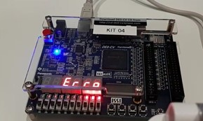
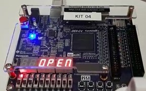

# Electronic Lock

## Introduction
This project was built in __VHDL__ on Intel Quartus Prime Software and consists on a electronic lock using a __FPGA__.  
The lock is based on a state machine and works as follows: Using a pre-stablished password (defined on the algorithm), the FPGA (with no other peripherals) takes user input from an arrangement of the switches, that symbolizes one digit, and from a button, who is responsible for registering that digit. This way, the FPGA compares that digit to the equivalent digit of the password and, if the result is true, it goes to the next state of the state machine and repeat the same logic, otherwise turns on a number of leds equivalent to the number of user input mistakes. This process goes on until the user gets the wrong digit 3 times, showing an "erro" message on the 7 segment displays, or until the user gets the whole password right, which turns on a different led indicating the correct answer and shows "open" on the same 7 segment displays.

## Key Concepts
* Logic Programmable Devices (FPGA)
* Logic gates
* Sequential and combinational circuits

## Screenshots
### Wrong password test

### Correct password test

## How to Run
To run the desired simulation of this project, just clone or download it and run it on the software Intel Quartus Prime (the version used was 20.1).   
For actual using on the FPGA, you will need to assign all the inputs and outputs to the corresponding device pins (the specific device used was the Altera Cyclone V 5CEBA4F23C7) and do all the steps necessary to generate and configure the files for further injection on the device.